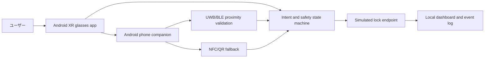
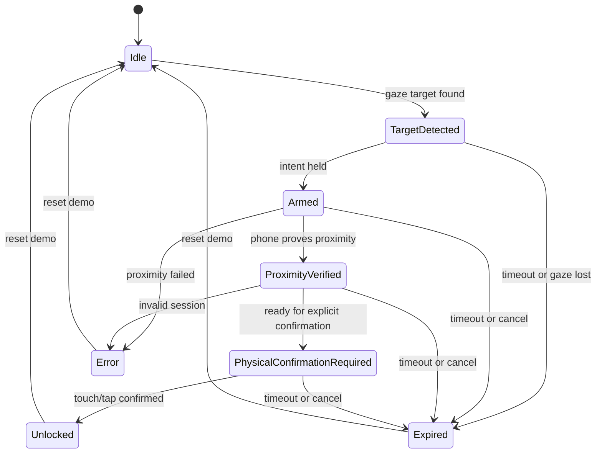

# LookLatch XR

LookLatch XR は、Android XR 向けの software-first コンセプトプロトタイプです。現実世界のロックされた対象を「見る」ことでアクセス意図を作り、Android スマートフォンで近接を検証し、最後にタッチまたはタップで確認する流れをデモします。

> Look to arm, phone to prove proximity, touch/tap to confirm.

このリポジトリは安全な実証用です。実車両、実スマートロック、実決済、実デジタルキーの解除手順や本番セキュリティ実装は含みません。視線は解除を実行せず、解除フローを arm するだけです。

## プロダクト概要

LookLatch XR は Android XR グラスを、現実世界のアクセス対象に対する intent layer として扱います。

1. ユーザーがロック対象を見る。
2. XR UI が対象を検出し、解除待機状態に入る。
3. Android phone companion が UWB/BLE などで近接を検証する。
4. タッチ、タップ、NFC、QR などの二段階目の明示確認を要求する。
5. simulated lock endpoint に対して「解除されたように見える」安全なイベントを送る。

初期デモは車両アクセスを題材にしますが、同じ UX は PC、ワークスペース、家の鍵、シャッター、共有モビリティ、物理アクセスポイントでの認証に広げられます。

## 安全モデル

- 視線だけでは解除しません。視線は `TargetDetected` または `Armed` までです。
- Android phone companion が近接証明の役割を持ちます。
- 最終アクションには物理確認が必要です。例: ドアノブ接触、グラスタップ、スマホ側確認、NFC/QR。
- すべてのロック結果は simulated endpoint の状態表示です。実物の解錠 API、車両 API、決済 API には接続しません。
- 本番セキュリティを主張しません。これは状態遷移、UX、責務分離を検証するためのプロトタイプです。
- 失効、キャンセル、エラーを通常フローとして扱います。

## ユーザージャーニー

1. ユーザーが Android XR グラスを装着してロック対象へ近づく。
2. グラスが対象を検出し、軽量な確認 UI を表示する。
3. ユーザーが意図を維持すると、フローが `Armed` になる。
4. スマートフォンが UWB/BLE セッションで対象との近接を検証する。
5. 近接が十分なら `PhysicalConfirmationRequired` に進む。
6. ユーザーがタッチまたはタップで明示確認する。
7. simulated lock endpoint が `Unlocked` イベントを表示する。
8. タイムアウト、視線逸脱、近接失敗、キャンセル時は `Expired` または `Error` に進む。

## アーキテクチャ



詳しくは [docs/architecture.md](docs/architecture.md) を参照してください。

## 状態遷移



詳しくは [docs/state-machine.md](docs/state-machine.md) を参照してください。

## リポジトリ構成

```text
.
├── android-xr-app/              # Kotlin/Compose Android XR app stub
├── phone-companion/             # Kotlin Android companion app stub
├── simulated-lock-endpoint/     # Local simulated lock dashboard
└── docs/
    ├── architecture.md
    ├── demo-script.md
    └── state-machine.md
```

## セットアップ

### Android stubs

Android Studio でこのリポジトリを開き、`android-xr-app` または `phone-companion` を実行します。

```bash
./gradlew :android-xr-app:assembleDebug
./gradlew :phone-companion:assembleDebug
```

このリポジトリには Gradle wrapper はまだ含めていません。必要に応じて Android Studio から wrapper を生成してください。

### Simulated lock endpoint

Node.js だけで動くローカルサーバです。外部パッケージは不要です。

```bash
cd simulated-lock-endpoint
npm start
```

既定では [http://localhost:4173](http://localhost:4173) でダッシュボードが開きます。

## ロードマップ

- MVP: Compose 画面、phone companion の fake proximity、simulated endpoint の接続。
- Next: QR/NFC fallback の UI と event contract を追加。
- Next: UWB/BLE provider の実機検証用 placeholder を本物の実装に差し替えられる構造へ整理。
- Later: PC/ワークスペース unlock demo、共有モビリティ/決済 authorization demo。
- Production research: OEM/partner API、正式な digital key、脅威モデル、監査、ユーザー同意設計。ただしこのリポジトリでは本番解錠を扱いません。

## デモ

デモの話し方は [docs/demo-script.md](docs/demo-script.md) にまとめています。
