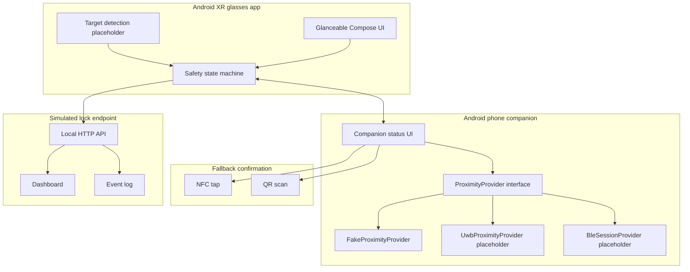
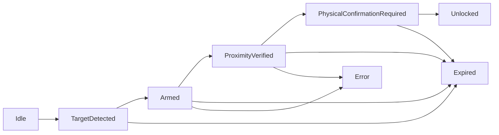

# Architecture

LookLatch XR は「視線による intent」「スマートフォンによる近接証明」「物理確認」を分けて扱います。プロトタイプではすべて simulated lock endpoint に接続し、実物のロックや車両 API には接続しません。

## 全体像

## Android XR glasses app

`android-xr-app/` は Kotlin/Compose の Android app stub です。現時点では Jetpack XR SDK や実カメラ認識は入れず、以下だけを表現します。

- `TargetDetected`
- `Armed`
- `ProximityVerified`
- `PhysicalConfirmationRequired`
- `Unlocked`
- `Expired`
- `Error`

XR 側の責務は、ユーザーに今の状態を短く示し、視線が作るのは intent だけだと明確にすることです。実解除の判定や鍵操作は持ちません。

## Android phone companion

`phone-companion/` は Android phone が近接証明と fallback の中心になることを示す stub です。

- `ProximityProvider`: 近接検証の抽象インターフェイス。
- `FakeProximityProvider`: デモ用の手動シミュレーション。
- `UwbProximityProvider`: Android UWB/Ranging 実装を後から差し込む placeholder。
- `BleSessionProvider`: BLE out-of-band session setup を後から差し込む placeholder。

プロトタイプ段階では `FakeProximityProvider` を使い、端末や車両の本物の鍵情報は扱いません。

## UWB/BLE proximity validation layer

UWB は高精度な距離/方向のヒント、BLE はセッション開始や out-of-band パラメータ交換の候補として扱います。この repository では API の形だけを定義し、実装は placeholder のままです。

責務:

- target id と session id の管理。
- 近接 confidence の生成。
- timeout、距離不足、セッション不整合のエラー化。
- state machine への `ProximityVerified` 通知。

非責務:

- 実車両の unlock。
- 実デジタルキーの発行や保存。
- production-grade security の保証。

## NFC/QR fallback

NFC/QR は close-range fallback として扱います。UWB が使えない端末、デモ会場、PC/ワークスペース demo では QR が便利です。NFC/QR も視線の代替ではなく、近接または明示確認を補助する signal です。

## Simulated lock/digital-key endpoint

`simulated-lock-endpoint/` は Node.js のローカルサーバです。ダッシュボードには lock state と event log だけを表示します。

- `LOCKED`: デモ開始状態。
- `SIMULATED_UNLOCKED`: 物理確認後だけ表示される simulated state。
- `EXPIRED`: timeout またはキャンセル。
- `ERROR`: セッション不整合など。

ここでの unlock は画面上の状態変更だけです。実物の鍵、車両、決済、アクセス制御システムには接続しません。

## Safety state machine

重要な invariant:

- `Idle` から `Unlocked` へ直接進まない。
- `TargetDetected` から `Unlocked` へ直接進まない。
- `Armed` は unlock ではない。
- `ProximityVerified` だけでも unlock ではない。
- `PhysicalConfirmationRequired` のあと、明示確認が成立して初めて simulated unlock になる。
