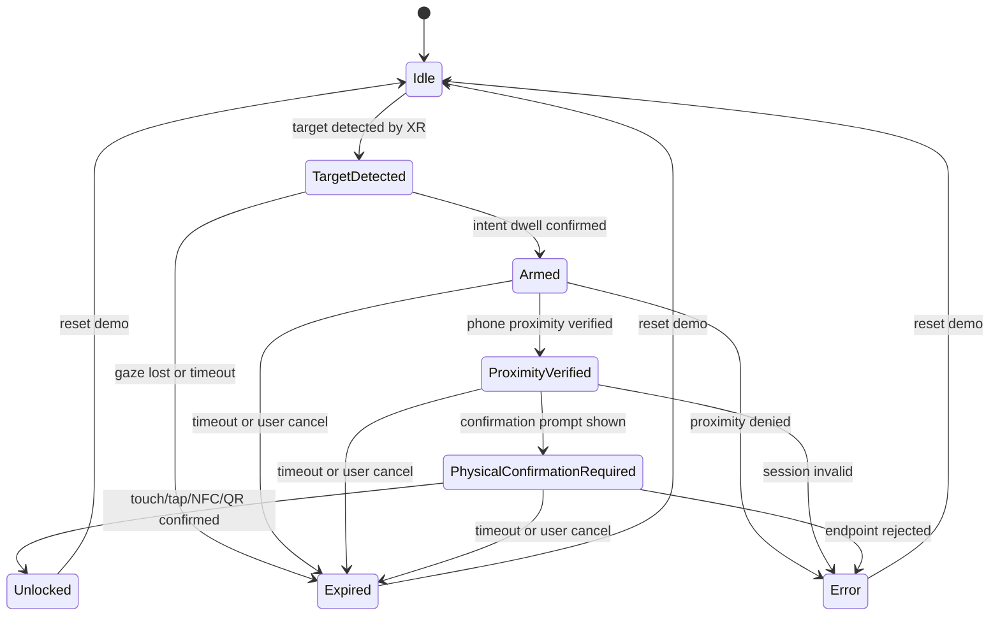

# State Machine

LookLatch XR の安全性は、解除までの責務を状態で分けることにあります。視線は最初の intent を作るだけで、単独では unlock に到達できません。

## States

| State | 意味 | unlock 可能か |
| --- | --- | --- |
| `Idle` | 対象を見ていない初期状態。 | いいえ |
| `TargetDetected` | XR 側が対象を検出した状態。 | いいえ |
| `Armed` | ユーザーの intent が保持され、解除待機になった状態。 | いいえ |
| `ProximityVerified` | phone companion が近接を検証した状態。 | いいえ |
| `PhysicalConfirmationRequired` | タッチ/タップ/NFC/QR などの明示確認を待つ状態。 | まだいいえ |
| `Unlocked` | simulated endpoint が解除済み表示になった状態。 | simulated only |
| `Expired` | timeout、視線逸脱、キャンセルで失効した状態。 | いいえ |
| `Error` | 近接失敗、セッション不整合、API 失敗など。 | いいえ |

## Diagram

## Event contract

| Event | 主な送信元 | 遷移 |
| --- | --- | --- |
| `target_detected` | Android XR app | `Idle -> TargetDetected` |
| `intent_held` | Android XR app | `TargetDetected -> Armed` |
| `proximity_verified` | Phone companion | `Armed -> ProximityVerified` |
| `confirmation_required` | Android XR app / endpoint | `ProximityVerified -> PhysicalConfirmationRequired` |
| `physical_confirmed` | Phone companion / XR tap / NFC | `PhysicalConfirmationRequired -> Unlocked` |
| `expired` | Any component | `TargetDetected/Armed/ProximityVerified/PhysicalConfirmationRequired -> Expired` |
| `error` | Any component | `Armed/ProximityVerified/PhysicalConfirmationRequired -> Error` |
| `reset` | Dashboard | `Unlocked/Expired/Error -> Idle` |

## Guard rules

- `physical_confirmed` は `PhysicalConfirmationRequired` 以外では unlock しない。
- `target_detected` は state を進めるだけで、lock state を変更しない。
- `proximity_verified` は physical confirmation を要求するだけで、lock state を変更しない。
- timeout は安全側へ倒し、`Expired` に進める。
- endpoint は invalid transition を event log に残し、unlock しない。
